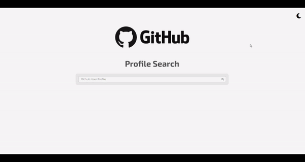

# GitHub Profil Kartı

Bu proje, kullanıcıların GitHub kullanıcı adlarını aratarak profil bilgilerine ve depolarına ulaşmasını sağlayan bir web uygulamasıdır. Uygulama, API aracılığıyla GitHub verilerini çeker ve bu bilgileri bir kart formatında ekranda gösterir. Ayrıca, kullanıcılar için dark/light mod seçeneği de bulunmaktadır.

## Özellikler

- Kullanıcı adı arama kutusu: Kullanıcılar, GitHub kullanıcı adlarını girerek arama yapabilirler.
- Profil bilgileri ve depo listesi: Girilen kullanıcı adına ait profil bilgileri ve depolar ekranda kart formatında gösterilir.
- Dark/Light mod: Kullanıcılar, sayfa temasını dark veya light mod olarak değiştirebilirler.
- Responsive tasarım: Uygulama, tüm cihazlarda düzgün bir şekilde görüntülenebilir.

## Teknolojiler

Bu projede kullanılan teknolojiler:

- **HTML5**: Sayfa yapısını oluşturmak için kullanıldı.
- **CSS3**: Stil ve düzenlemeler için kullanıldı.
- **JavaScript**: API ile veri çekme ve etkileşimli özellikler için kullanıldı.
- **GitHub API**: Kullanıcı profilleri ve depo bilgilerini almak için kullanıldı.

- 
## Ekran Görüntüleri
  

  
## Kurulum

Projeyi yerel ortamınızda çalıştırmak için aşağıdaki adımları izleyin:

1. Bu projeyi klonlayın:
    ```bash
    git clone https://github.com/cengo14/js-github-profile-card-project
    ```
2. Proje dizinine gidin:
    ```bash
    cd js-github-profile-card-project
    ```
3. Proje dosyalarını bir tarayıcıda açarak çalıştırın.

## Kullanım

1. Sayfa yüklendikten sonra arama kutusuna bir GitHub kullanıcı adı girin.
2. `Ara` butonuna tıklayın veya Enter tuşuna basın.
3. Kullanıcıya ait profil bilgileri ve depo listesi ekranda kart formatında gösterilecektir.
4. Sağ üst köşedeki butonu kullanarak dark/light mod arasında geçiş yapabilirsiniz.

## Katkıda Bulunma

Katkıda bulunmak isterseniz, lütfen bir pull request açmadan önce projeyi fork edip kendi dalınızda değişiklik yapın. Önerileriniz ve geliştirmeleriniz için teşekkür ederiz!

## Lisans

Bu proje MIT Lisansı ile lisanslanmıştır. Daha fazla bilgi için `LICENSE` dosyasına bakabilirsiniz.

